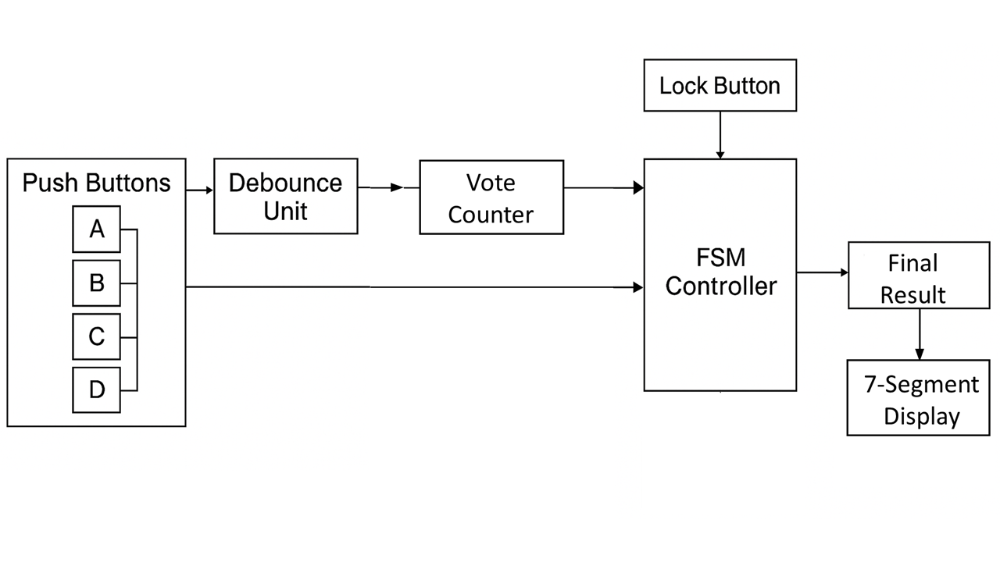
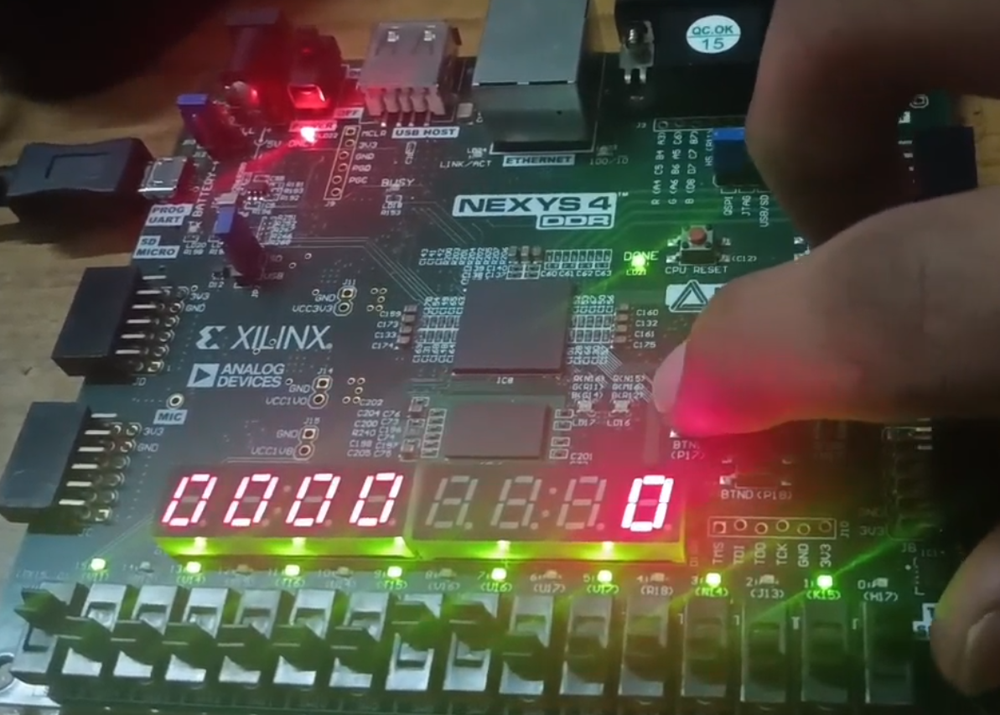

# Verilog-Voting-Machine

## Description
This project implements a minimalist voting machine using the hardware description language **Verilog**, and deploys it on the **Nexys 4 DDR FPGA**.

---

## Objectives
1. **Develop a control signal** to start and stop the voting process.
2. **Synchronize input button signals** with the clock pulse.
3. **Compare vote counts** and declare the final result.
4. **Display voting and result data** using the **7-Segment Display** and **LCD**.

---

##  FSM (Finite State Machine) Design

The core FSM controls the voting process through **four states**:

#### 1. `IDLE`
- Awaits admin code (`sw == admin_code`) and `btn_ov_cv` to transition to `VOTING_OPEN`.

#### 2. `VOTING_OPEN`
- Allows voting via `btn_1`, `btn_2`, or `btn_3`.
- Voting is enabled (`enable_leds = 1`).
- Returns to `VOTING_CLOSED` when admin code and `btn_ov_cv` are activated again.

#### 3. `VOTING_CLOSED`
- Waits for **three 1 Hz cycles** (`vc_ctr` counts to `2'b11`) before proceeding.

#### 4. `DISPLAY_WIN`
- Displays the **winning candidate**.
- Returns to `IDLE` when `btn_ov_cv` is pressed again.

---

## Features

- **Finite State Machine (FSM) based Control Logic**  
  Efficient state transitions across `IDLE`, `VOTING_OPEN`, `VOTING_CLOSED`, and `DISPLAY_WIN`.

- **Admin Lock/Unlock System**  
  Secure voting control using an admin switch input and confirmation button.

- **Debounced Button Inputs**  
  Ensures clean vote registration by filtering mechanical bounce from push buttons.

- **Per-Candidate Vote Counting**  
  Individual vote counters (using 4-bit registers) for each candidate button.

- **7-Segment Display Integration**  
  Live total vote count output on the 7-segment display.

- **Final Result Evaluation Logic**  
  Compares all vote counts and determines the winning candidate or tie.

- **Implemented on Nexys 4 DDR FPGA**  
  Complete hardware deployment tested using Xilinx Vivado and on-board peripherals.

- **Clock Synchronization**  
  All inputs and counters operate synchronously with the main clock.

---

## Block Diagram

---

## FPGA Implementation Demo

